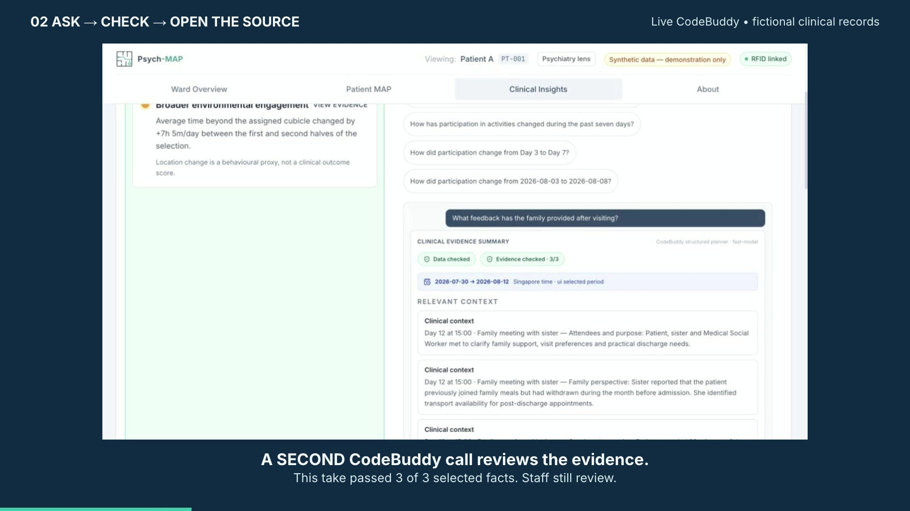

# Psych-MAP

### See the pattern. Ask a question. Check the evidence.

Psych-MAP brings ward activity, clinical notes and staff questions together.
It helps care teams find useful information, notice gaps and review AI suggestions.

**Three connected apps. Three CodeBuddy engines. People make the final decisions.**

<!-- connected-demo-video:start -->
[](https://github.com/chankuanghong/psych-map/releases/download/connected-demo-2026-09-09/Psych-MAP-Connected-Demo.mp4)

**Three standalone engine videos**

1. [Engine 1 — Clinical answers](https://github.com/chankuanghong/psych-map/releases/download/connected-demo-2026-09-09/Psych-MAP-Clinician.mp4) — 38 seconds
2. [Engine 2 — Question intelligence](https://github.com/chankuanghong/psych-map/releases/download/connected-demo-2026-09-09/Psych-MAP-Question-Scan.mp4) — 18 seconds
3. [Engine 3 — Weekly research review](https://github.com/chankuanghong/psych-map/releases/download/connected-demo-2026-09-09/Psych-MAP-Weekly-Review.mp4) — 18 seconds

[Full connected demo (90s)](https://github.com/chankuanghong/psych-map/releases/download/connected-demo-2026-09-09/Psych-MAP-Connected-Demo.mp4) · [RFID simulation (16s)](https://github.com/chankuanghong/psych-map/releases/download/connected-demo-2026-09-09/Psych-MAP-RFID.mp4)

Fictional data and simulated RFID. Real browser interactions and live CodeBuddy calls,
with waiting shortened. [Capture details and limitations](docs/DEMO_VIDEO.md).
<!-- connected-demo-video:end -->

[Try the demo](#try-the-demo) · [How answers are built](docs/ANSWER_FLOW.md) · [Test results](evals/published/REPORT.md) · [Slides](Psych-MAP_tested-demo-deck.html)

All included patient cases are fictional. This hackathon project is a research
prototype, not a clinically validated system.

## See what works

These examples come from recorded tests, not scripted AI answers.

| Example | What happened |
| --- | --- |
| **Ask about family feedback** | CodeBuddy found the Day 12 note: the sister described withdrawal before admission and offered transport for follow-up appointments. Staff opened the exact note. The second AI review passed all five selected facts. |
| **Compare recorded activity** | For Patient C, recorded overnight presence in the assigned cubicle was 140 minutes on Day 7 and 350 minutes on Day 11. Code retrieved the values. Presence is not proof of sleep. |
| **Learn from staff questions** | Two identical questions from different staff groups became one question group with a count of two. A repeat scan did not count them again. New topics needed administrator approval. |
| **Review a research suggestion** | Code calculated spatial averages for Patient B. CodeBuddy judged agreement with the clinician note as unclear. The recommendation was to review the evidence and keep thresholds unchanged. |

**Explore the proof:** [Live browser example](evals/published/BROWSER_CHECK.md) ·
[Answer engine](evals/published/engine-1.md) ·
[Question scanner](evals/published/engine-2.md) ·
[Research reviewer](evals/published/engine-3.md)

### When more information is needed

The app explains when the records cannot answer a question. For example, room
presence alone cannot answer “How has the patient been sleeping?” The tested
response requested sleep observations or patient-reported sleep information.

Some answers are partial; others need more documentation.
[All 14 doctor-question results remain available here](evals/published/DOCTOR_ANSWERS.md).

## Three apps

| App | What people do |
| --- | --- |
| **RFID dashboard** | See tag detections, choose the scanner location and inspect recorded presence. |
| **Clinician app** | View the ward, explore patient maps, ask questions and open supporting notes. |
| **Admin console** | See question patterns, approve topics for each profession and review research suggestions. |

The RFID dashboard and clinician app share the application database. Questions
are stored by patient. The admin console uses a separate question catalogue and review store.

## Three CodeBuddy engines

| Engine | When | What CodeBuddy does | What code and people control |
| --- | --- | --- | --- |
| **Answer assistant** | On demand | Plans what evidence to read and explains the results. | Code checks requests, retrieves facts and calculates values. Staff inspect sources. |
| **Question scanner** | Nightly or manually | Groups similar questions and identifies possible topic gaps. | Code counts and saves results. Admins approve policies. |
| **Research reviewer** | Weekly or manually | Chooses comparison periods and reviews signals alongside clinician notes. | Code calculates comparisons. Admins review suggestions; live thresholds stay unchanged. |

### Who writes the answer?

- **Application code:** recorded facts, numbers, dates and source excerpts.
- **CodeBuddy:** a separate, labelled interpretation and requests for missing information.
- **Staff:** check the evidence and make clinical decisions.

Code rejects invented fact IDs, missing sources and invalid tool requests.
A second AI review checks the proposed interpretation. If that review fails,
interpretations and extra pointers are withheld. SQLite saves the question,
evidence and final answer before delivery.

If evidence is incomplete, CodeBuddy can request **one different retrieval**
within the same patient/date scope. Code blocks repeated or invalid requests.
Both attempts are recorded. If documentation is still missing, the answer says so.

These checks reduce fabrication. They do not guarantee that every interpretation
is correct or useful.

[See the flowchart and worked example](docs/ANSWER_FLOW.md) · [Audit details](docs/answer-audit.md)

## Tested, not just described

| Check | Recorded result |
| --- | --- |
| Application tests | **78 passed** |
| RFID software tests | **35 passed** |
| Live CodeBuddy scenarios | **18 latest results passed**, across the initial run and targeted retests |
| Live browser test | Family question → retrieval → second review → source inspection → saved audit |
| Build and GitHub CI | Passed for the tested code |

The 18 scenarios include 14 doctor questions, a spatial comparison, an ambiguous
question and both background engines. A pass can mean correctly reporting missing
evidence—not answering every clinical question.

Failed attempts and fixes remain visible. This was not one flawless run.
A new physical RFID read was not verified in the latest test.

[Results and fixes](evals/published/REPORT.md) · [Dataset and test method](evals/README.md)

## Try the demo

### What you need

**Software:** Node.js 24, npm, Python 3.9+ and the `sqlite3` command.
Hardware is optional for exploring the pages and fictional data.

**Live AI:** An installed, authenticated CodeBuddy CLI with access to `fast-model`.
Follow your event/provider's official installation instructions and check that
`codebuddy --help` works. Live AI sends selected demo evidence to CodeBuddy and uses tokens.

### Start the apps

```sh
git clone https://github.com/chankuanghong/psych-map.git
cd psych-map
npm ci
npm run demo:setup
npm run dev -- --host 127.0.0.1 --port 5175 --strictPort
```

- Clinician app: `http://127.0.0.1:5175/`
- Admin console: `http://127.0.0.1:5175/admin`

Setup creates fictional SQLite stores. It preserves complete existing fixtures
and stops if only part of a fixture set exists.

In a second terminal, from the project folder:

```sh
python3 rfid-scanner/dashboard.py --allow-missing-reader
```

RFID dashboard: `http://127.0.0.1:8765/`. It shares the application database.
Press Ctrl-C in each terminal to stop the services.

### Turn on CodeBuddy

Copy `.env.example` to `.env` and set:

```dotenv
CODEBUDDY_ENABLED=true
CODEBUDDY_QUESTION_SCAN_ENABLED=true
CODEBUDDY_RESEARCH_ENABLED=true
```

Restart the app. Use admin buttons for manual scans and research.
Keep `QUESTION_CRON_ENABLED=false` and `RESEARCH_CRON_ENABLED=false` if you
do not want scheduled runs. AI is disabled by default.

**macOS shortcut:** After setup, `Launch Psych-MAP Demo.command` starts the services
and opens the pages. It enables CodeBuddy and both schedules, consumes tokens and
opens a LAN demo view. Use fictional data on a trusted network. Keep its terminal open.

## Add a real RFID reader

You need a **YRM100 UHF reader**, suitable antenna and power supply, a USB serial
connection, compatible **UHF tags**, and any required manufacturer driver.
Phone NFC tags are not a substitute. Optional: `python3 -m pip install pyserial`.

One reader represents one selected ward location. This is not precise indoor
positioning; signal strength is not converted to distance.

Only fictional tag IDs are included. Put your mapping in ignored `rfid-tags.local.json`:

```json
{"YOUR_TAG_EPC":{"name":"Demo volunteer","subject_id":"PT-003"}}
```

```sh
export RFID_TAG_MAP="$PWD/rfid-tags.local.json"
python3 rfid-scanner/dashboard.py --allow-missing-reader
```

Check reader status, select its location, present a tag and look for a new timestamp.
Unmapped tags have no patient assignment. [RFID details](rfid-scanner/README.md)

## Run the tests

```sh
npm test
(cd rfid-scanner && python3 -m unittest discover -s tests)
npm run build
```

These checks need no AI credentials. For live scenarios:

```sh
npm run eval:live
```

Live evaluations use fictional evidence, consume tokens and retain failed results.
Their question and review databases are isolated from the demo.

## Project files

| Folder | Purpose |
| --- | --- |
| `src/` | Clinician/admin pages, metrics and evidence formatting |
| `server/` | API, planner, validation and answer audit |
| `rfid-scanner/` | Reader connection and presence dashboard |
| `simulation/` | Fictional-data setup, question scans and research jobs |
| `config/` and `contracts/` | Agent instructions and output rules |
| `test/` and `evals/` | Tests, live results and execution examples |

Generated storage: `data/psych-map.sqlite` for application records and audits;
`simulation/patients/` for patient fixtures and questions;
`simulation/organization/` for the catalogue and review decisions.

Journal access and validated threshold estimation are future work.
Current research suggestions use the application's existing records.
