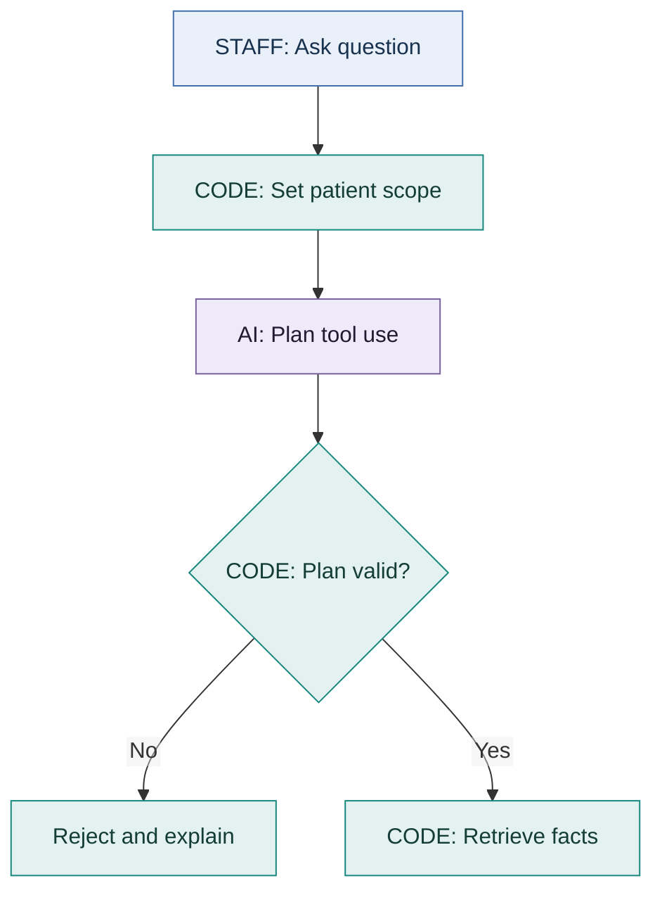
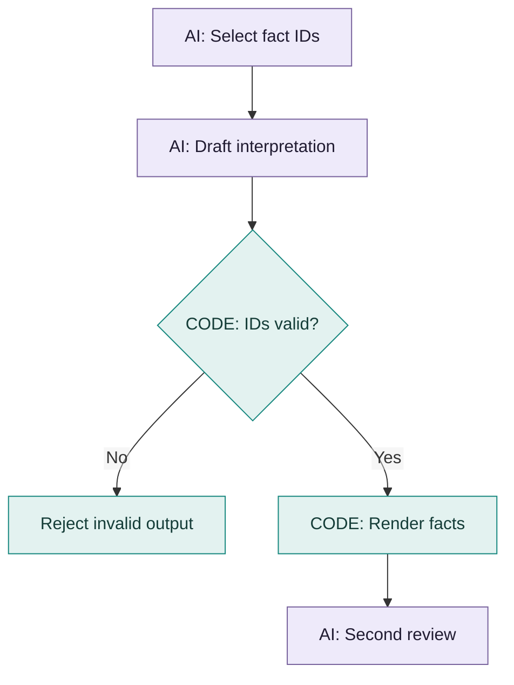
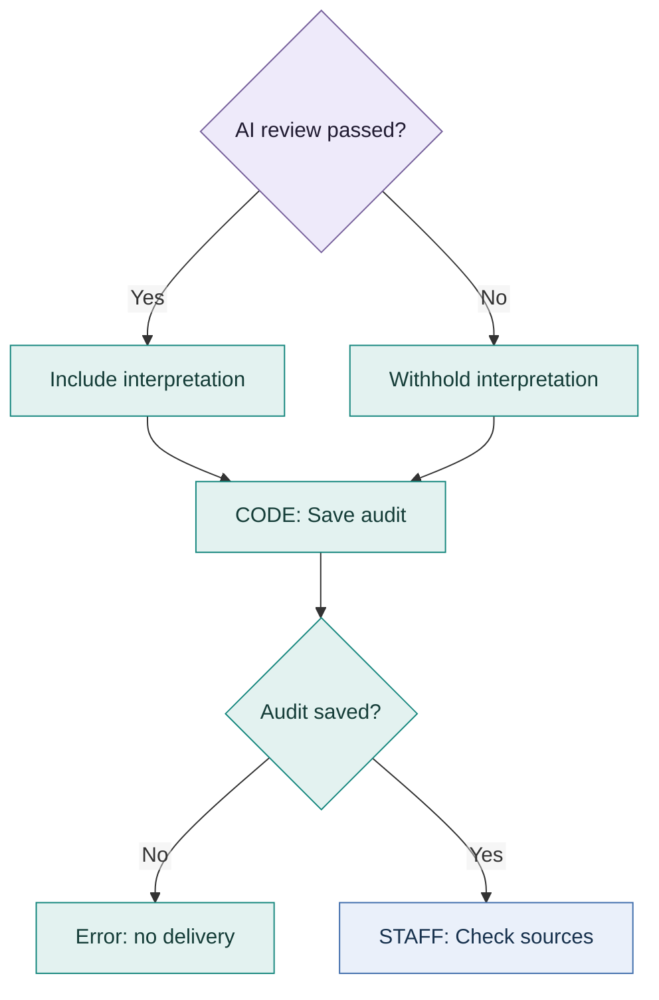

# Who builds the answer?

**CodeBuddy chooses and explains. Code retrieves, calculates and checks.
Staff judge the clinical meaning.**

## The whole process at a glance

| Step | Who | What happens |
| --- | --- | --- |
| 1 | Staff | Choose patient and dates. Ask the question. |
| 2 | CodeBuddy | Propose which tools and records to use. |
| 3 | Code | Validate the plan. Retrieve facts and calculate values. |
| 4 | CodeBuddy | Select fact IDs and write a separate interpretation. |
| 5 | Code + CodeBuddy reviewer | Code checks IDs and sources. The reviewer checks meaning and support. |
| 6 | Code + Staff | Save the audit, display the result and let staff inspect the sources. |

The diagrams below split the same process into three readable parts.
**Purple = CodeBuddy. Green = application code. Blue = staff.**

### A. Plan and retrieve



**How the code checks:** the tool must exist, fields and metrics must be allowed,
and requested days must belong to the evidence scope. Code retrieves records,
calculates values and attaches fact IDs and source IDs.

### B. Write and review



**Who writes what:** code renders the stored factual wording and values.
CodeBuddy writes the separate interpretation. Code rejects invented IDs and
missing sources. The **second CodeBuddy review** checks relevance and whether
the selected facts support the answer and interpretation. It is not a grammar
guarantee or a clinical validation.

### C. Save and show



**If review fails or errors:** show a warning; withhold AI interpretation,
supplementary pointers and proposed graph actions. Source-backed facts can remain.
**If the audit write fails:** do not deliver the answer.

These are calls inside the **answer engine**, not the three product engines.
The other engines are question scanning and weekly research.

A planner can instead ask for clarification. With no adequate retrieved facts,
the app reports missing evidence and does not run the second reviewer.
Early invalid requests are rejected before this answer-audit flow.

## Specific example: family feedback

**Want the exact output, not the simplified explanation?**
[Open the recorded answer, full plan, six tool results and second-review verdict](../evals/published/FAMILY_EXACT_TRACE.md).

**Question:** “What feedback has the family provided after visiting?”

**Fixture:** Fictional Patient A, Days 1–14. The following uses the actual note and
observed browser answer; JSON below is shortened to explain the mechanism.

### 1. Code prepares the source fact

The Day 12 family note contains:

> Sister reported that the patient previously joined family meals but had withdrawn during the month before admission. She identified transport availability for post-discharge appointments.

Code gives this source the ID `source:clinical:PT-001:71cf094b` and creates a fact
with ID `fact:source:clinical:PT-001:71cf094b`. Its stored statement includes the
date, section title and original wording.

### 2. CodeBuddy selects it and proposes an interpretation

Simplified selection:

```json
{
  "factIds": ["fact:source:clinical:PT-001:71cf094b"]
}
```

One actual interpretation from the browser run was:

> Attributed family feedback during the recorded meeting: the sister reported that the patient had previously joined family meals but had withdrawn during the month before admission, and she identified transport availability to support post-discharge appointments.

The real response selected five family-meeting facts. Each interpretation listed
supporting selected fact IDs. [Full browser result](../evals/published/BROWSER_CHECK.md)

### 3. Code checks; the second AI reviewer reviews

| Proposed output | Who checks it? | What happens? |
| --- | --- | --- |
| An invented fact ID | Code | Rejects it because it is absent from retrieved facts. |
| A fact with an absent source | Code | Rejects it because its source cannot be resolved. |
| The valid family fact ID | Code | Renders the stored statement, with original wording. |
| “The sister will be the caregiver” | AI reviewer and staff | Must assess whether the source supports this. Transport availability does not establish a caregiving agreement. ID checks alone cannot catch every such mistake. |

The observed second review passed **5/5** facts. Code saved the answer and full
evidence snapshot before display. Staff opened an exact source in the browser.

### 4. What the staff member sees

- **Recorded evidence:** date, note section and source text, rendered by code.
- **CodeBuddy interpretation:** a separate explanation, labelled for human review.
- **Exact source:** expandable record with source ID and context.
- **Limitations or information requests:** when the selected evidence is incomplete.

## What about grammar and accuracy?

**Code-generated facts:** templates control the surrounding sentence. Original
note wording is preserved, including imperfect grammar.

**AI interpretation:** CodeBuddy writes natural language. Structure and length
are checked; grammar and meaning are not mathematically guaranteed. A second AI
review is fallible too.

**Deterministic means:** the same snapshot and validated plan produce the same
retrieval and calculations. It does not mean CodeBuddy always selects the same
plan, or that every interpretation is clinically correct.

## The other two engines

| Stage | Question scanner | Weekly researcher |
| --- | --- | --- |
| CodeBuddy proposes | Question category and matching group | Comparison periods and an assessment of agreement with clinician notes |
| Code performs | Validation, counts, deduplication and SQLite writes | Validation, averages and review-record storage |
| Admin decides | Approve or reject a policy topic | Keep or ignore a suggestion and add notes |
| What does not happen automatically | A new group becoming approved clinical policy | A suggestion changing live thresholds |
